# Lets Cook

## Description

This project is a webpage that allows users to input ingredients they have in the fridge and suggest recipes based on that input. This project was made with the idea to minimize food waste from every fridge.

## Technologies used

This project was made by using HTML, CSS, Javascript, Bulma, the Grammarly API, and the Spoonacular API.

## Usage

* Please click on the following link of the deployed website, https://leeclaire156.github.io/Lets-Cook/

* The application should appear as so on screens upon load if the user has never used the application:
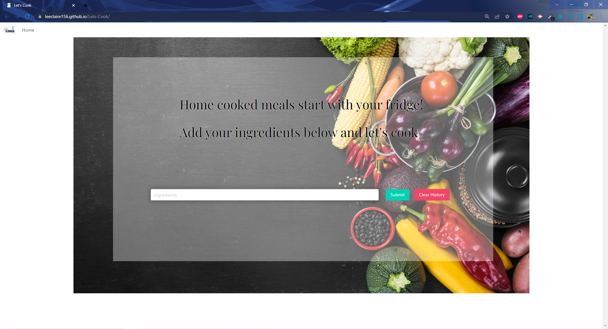

* The application should appear as so on screens upon load if the user has previously used the application:
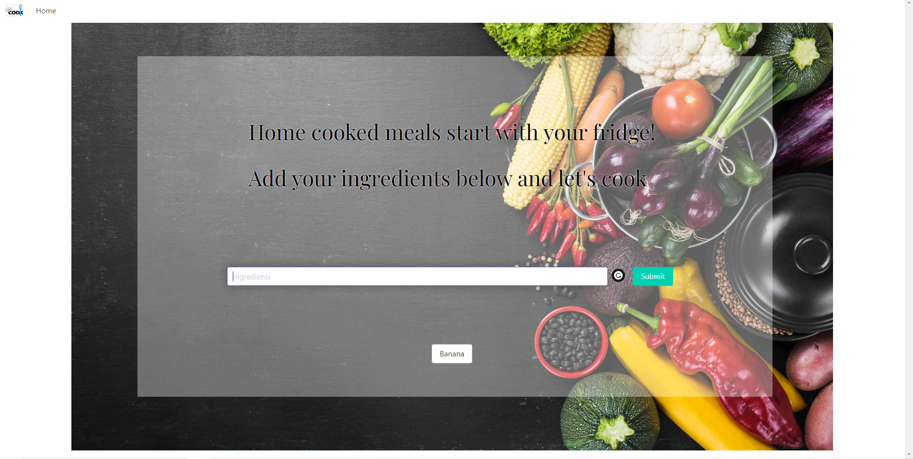 

* If the user does not type anything into the input form, an error modal will pop up stating something must be typed in.
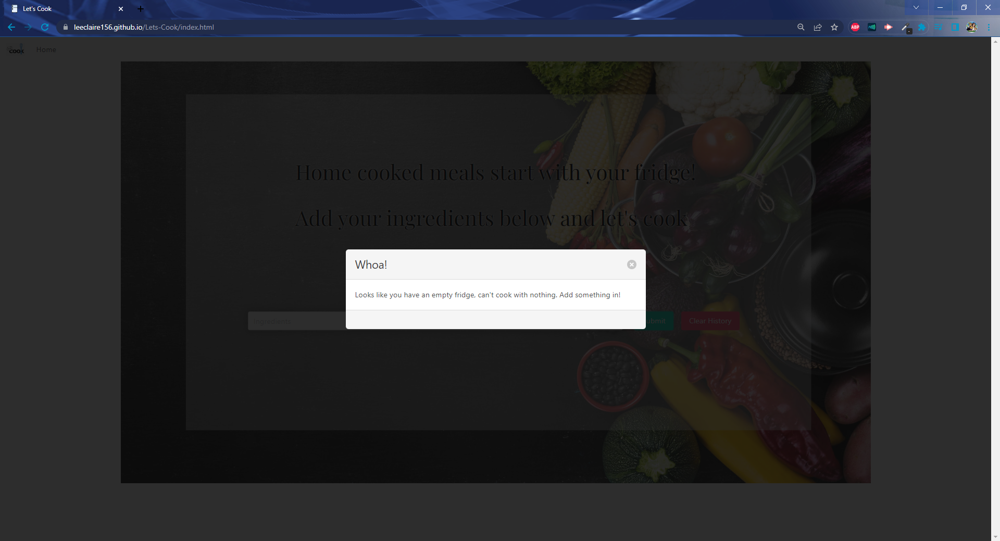

* After typing, a Grammarly button will appear between the input form and submit button. Users can use the Grammarly's spell checking API to double check their spelling before clicking submit.
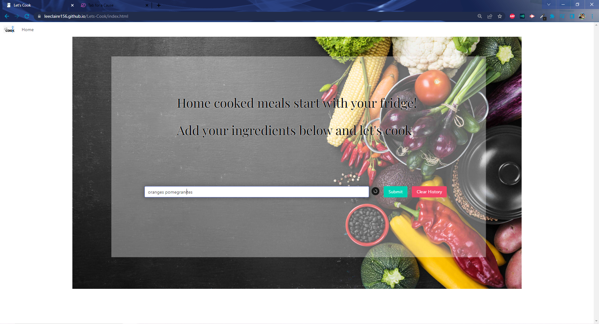
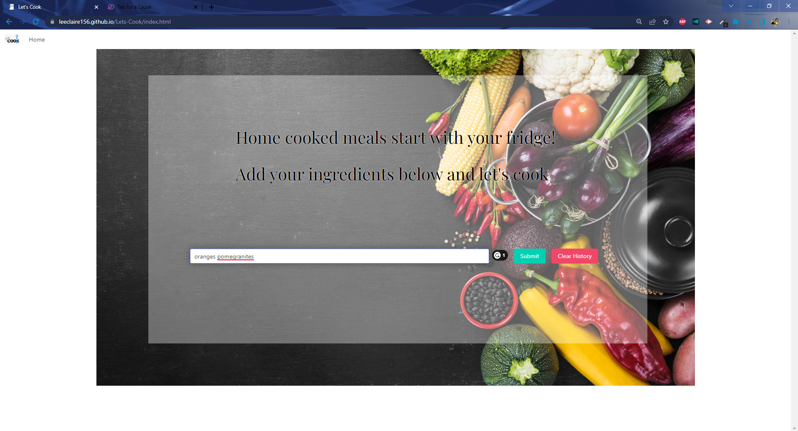
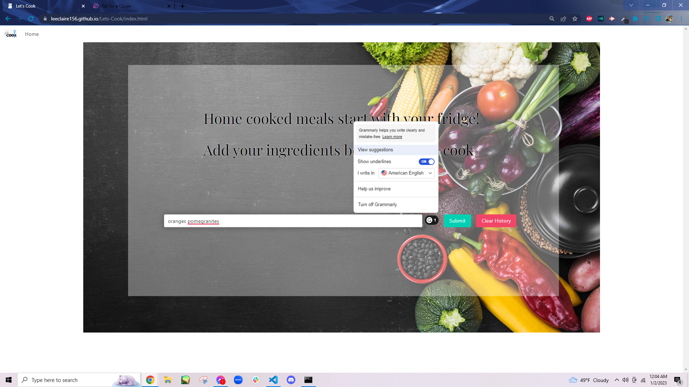
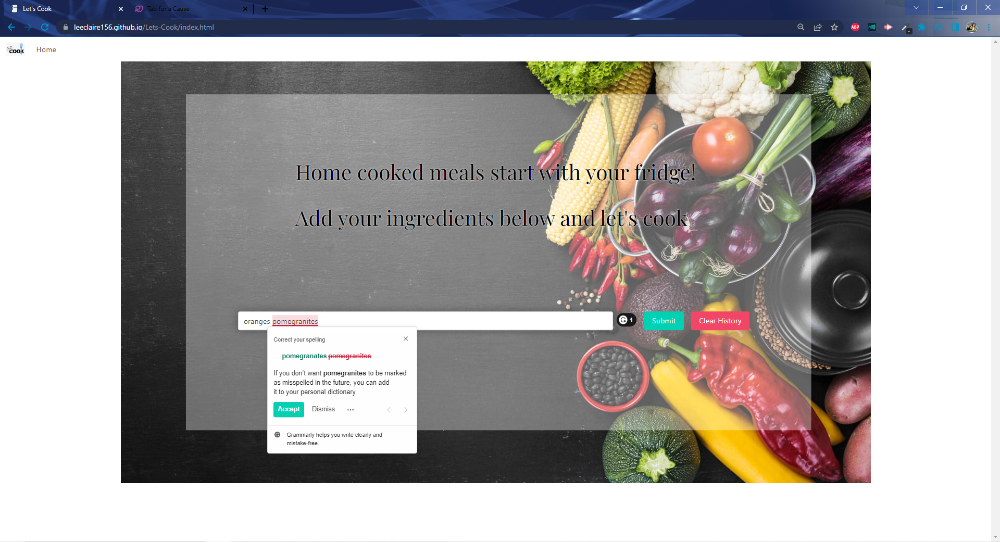

* If users have correct spelling, or if Grammarly has no suggestions to make, the Grammarly button icon will have no number attached.
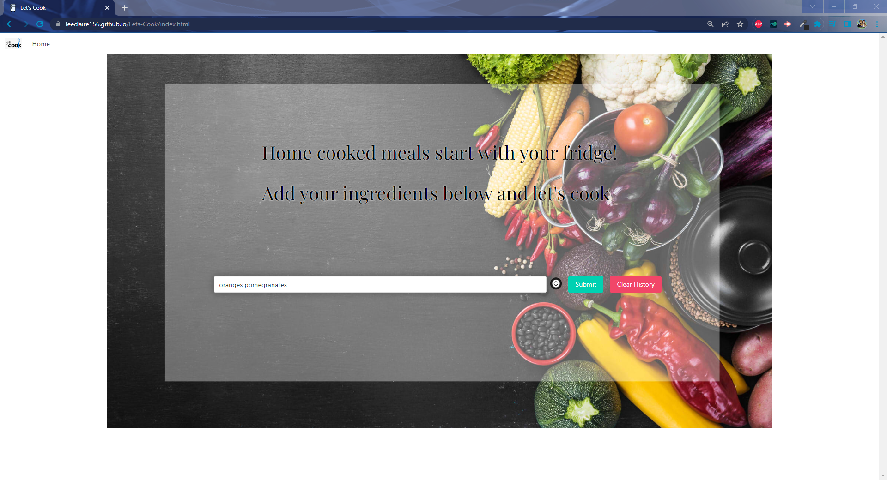
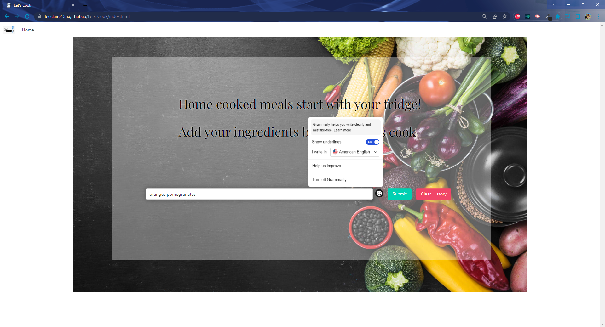

* When the user looks up an ingredient, a button with the query's text contents is created under the search input area of the homepage after returning from the results page.

 

* When the user clicks on the Clear History button, the local storage will be cleared of all past searches.

 

* Clicking on the button will display the recipe search for those items again.

* Clicking the Submit button or hitting the Enter key will take the user to the results page, were up to 12 recipes may be displayed based on the query.
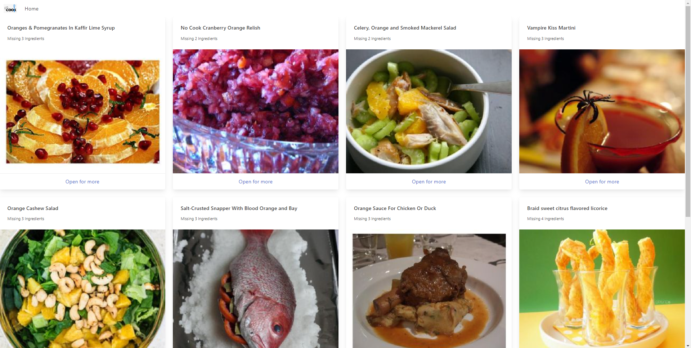

* Clicking 'Open for More' on the bottom of each recipe card will open the recipe's information in a modal.
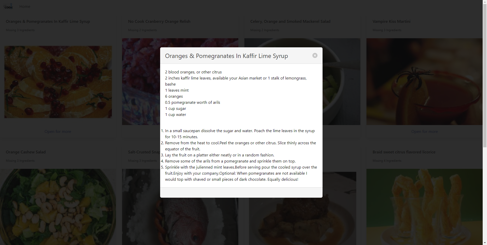

* If the user uses up the daily quota of searches from Spoonacular's API, a 402 error modal will pop up on the results page. Clicking the "Home" button returns the user to the home page. The daily allowance of requests from Spoonacular is 150 points, where a search takes 1 point to perform and for every recipe returned is 0.01 points, meaning each search can consume anywhere from 1.01 points to 1.12. In addition, opening a recipe takes up a point as well. This allowance returns at midnight UTC or 7:00 p.m. EST.

## Contributors

This project was created by [André Brahin](https://github.com/VenBak), [Erica Del Rio](https://github.com/irecatyl), [Muhammad Jamil](https://github.com/Muhammadjamil720), and [Claire Lee](https://github.com/leeclaire156).

* André was responsible for the wireframing, HTML, integrating Bulma's CSS framework, and utilizing local storage for past searches to create interactive search history buttons. 
* Erica was responsible for the styling the recipe modals and making the Enter keydown event equivalent to clicking the Submit button.
* Muhammad was responsible for cleaning up the code.
* Claire was responsible for integrating the Grammarly API and the recipe information into the result page modals using the Spoonacular API, styling the front page with CSS, creating the no input error modal along with the error 402 modal, adding the clear history button, and updating the README file.

## Credits and Tutorials Followed

* Grammarly API implementation provided by [grammarly for developers](https://developer.grammarly.com/):   
https://developer.grammarly.com/docs/

* Spoonacular API implementation provided by [Spoonacular](https://spoonacular.com/food-api):   
https://spoonacular.com/food-api/docs#Search-Recipes-by-Ingredients
https://spoonacular.com/food-api/docs#Get-Recipe-Information 

* Pots and vegetables harvest picture (renamed as Main-Pg-Banner-Original in Assets/Images) provided by:  
https://www.freepik.com/free-photo/pots-vegetables-harvest_1440232.htm#query=food&position=17&from_view=search&track=sph

* Resizing image services provided by [iLoveIMG](https://www.iloveimg.com/):   
https://www.iloveimg.com/resize-image#resize-options,pixels

* Lets Cook nav image provided by [Adobe Stock](https://stock.adobe.com/):  
https://stock.adobe.com/search?k=lets+cook&search_type=usertyped&asset_id=283519857

* Favicon <a href="https://www.flaticon.com/free-icons/fridge" title="fridge icons">Fridge icon created by Freepik - Flaticon</a>:  
https://www.flaticon.com/free-icon/fridge_2333450?term=fridge&page=1&position=4&origin=tag&related_id=2333450

* Credit for assigning submit button to redirect to the result page HTML goes to [MDN](https://developer.mozilla.org/en-US/):  
https://developer.mozilla.org/en-US/docs/Web/API/Location/assign

* Web API location.assign() supplemental lesson provided by [Geeks for Geeks](https://www.geeksforgeeks.org/):  
https://www.geeksforgeeks.org/difference-between-window-location-href-window-location-replace-and-window-location-assign-in-javascript/

* Playfair Display font provided by [Google Fonts](https://fonts.google.com/):  
https://fonts.google.com/specimen/Playfair+Display

* Credit to placing array items into a list for HTML through document object manipulation goes to [gavgrif](https://stackoverflow.com/users/5867572/gavgrif):  
https://stackoverflow.com/questions/46141450/create-li-from-loop-through-array-and-display-to-html-as-a-list

* Image resizing credit via CSS goes to [developedbyed](https://www.youtube.com/@developedbyed):  
https://youtu.be/Xc6G3oV24yE?t=536

* Text shadow lesson provided by [Geeks for Geeks](https://www.geeksforgeeks.org/):   
https://www.geeksforgeeks.org/css-font-border/

* Flexbox guide provided by [CSS-Tricks](https://css-tricks.com/):   
https://css-tricks.com/snippets/css/a-guide-to-flexbox/

* Grammarly button and customization guide provided by [Grammarly for Developers](https://developer.grammarly.com/):  
https://developer.grammarly.com/docs/customization

* Triggering submit button on enter tutorial provided by [W3schools](https://www.w3schools.com/default.asp):  
https://www.w3schools.com/howto/howto_js_trigger_button_enter.asp